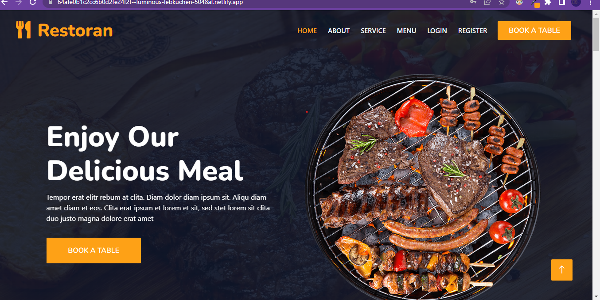
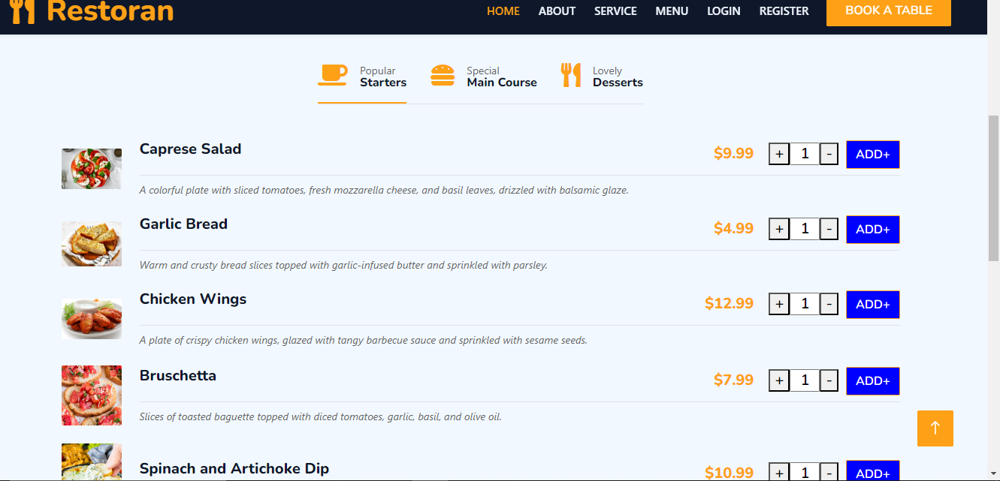

//how to run code

//git clone https://github.com/kishor7008/fleksa/

//npm i on both backend and frontend root directory

//already i am depoly backend server in render.com

//you can also use https://fleksa-backend.onrender.com/ url or local server

//to start frontend  or backend
//in terminal enter npm start  

Home Page

click on menu button to show menu items

you can order item after login 

register and login 

